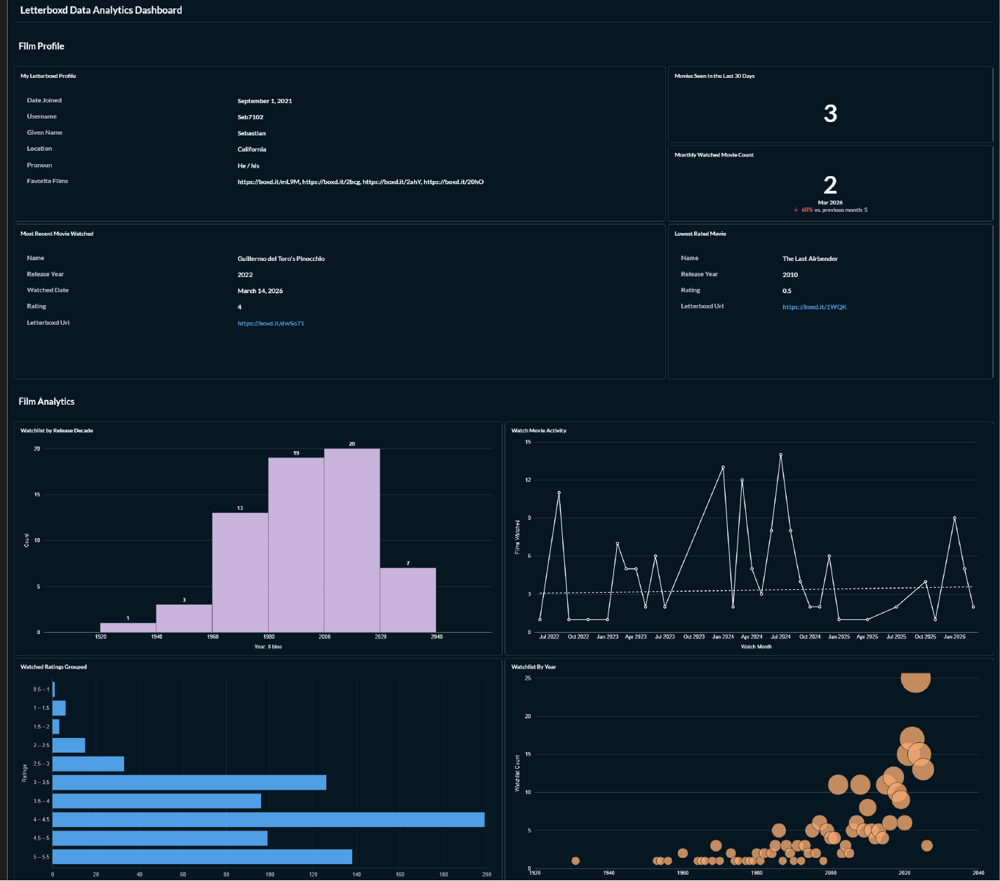

# Letterboxd Data Pipeline

A portfolio-grade ELT project that ingests personal Letterboxd exports, preserves raw files in object storage, loads a Postgres warehouse, transforms data with dbt, orchestrates workflows with Apache Airflow, and serves analytics in Metabase.

## Project Summary

This repository demonstrates an end-to-end data engineering workflow built with production-minded separation of concerns:

- `FastAPI` handles file ingestion
- `MinIO` stores immutable raw CSV exports
- `Postgres` stores ingestion metadata
- `Postgres` also serves as the analytical warehouse
- `bronze_loader` lands raw data into warehouse bronze tables
- `dbt` builds silver and gold models
- `Airflow` orchestrates ingestion, bronze loading, and transformations
- `Metabase` exposes the final analytical layer

The project is designed to show how a modern local data platform can be assembled with clear service boundaries, reproducible infrastructure, and a workflow that is easy to explain in interviews.

## Business and Technical Purpose

Letterboxd exports are useful personal datasets, but the raw CSV files are not structured for downstream analytics. This project turns those exports into a layered analytics pipeline:

- raw files are preserved unchanged for traceability
- ingestion metadata is captured separately from warehouse data
- bronze tables provide warehouse access to landed raw data
- dbt standardizes and models the data into reusable analytical assets
- Airflow provides orchestration, retries, visibility, and scheduling
- Metabase turns the resulting gold layer into a lightweight BI experience

From a technical perspective, the project demonstrates practical patterns that matter in data engineering work:

- medallion-style data layering
- object storage backed ingestion
- containerized local development
- orchestration with task dependencies and retries
- transformation modeling with dbt
- analytics delivery through a BI layer

## Final Architecture

```text
                     +------------------------+
                     | Letterboxd CSV Exports |
                     +-----------+------------+
                                 |
                                 v
                    +--------------------------+
                    | FastAPI Ingestion Layer  |
                    | upload endpoint + UI     |
                    +-----------+--------------+
                                | \
                                |  \
                                v   v
                  +----------------+  +----------------------+
                  | MinIO Raw Zone |  | Metadata Postgres    |
                  | immutable CSVs |  | ingestion_runs       |
                  +--------+-------+  +----------------------+
                           |
                           v
                  +-------------------------+
                  | Airflow DAG             |
                  | letterboxd_pipeline     |
                  +-----------+-------------+
                              |
                              v
                  +-------------------------+
                  | bronze_loader           |
                  | raw object -> bronze.*  |
                  +-----------+-------------+
                              |
                              v
                  +-------------------------+
                  | Warehouse Postgres      |
                  | bronze / silver / gold  |
                  +-----------+-------------+
                              |
                              v
                  +-------------------------+
                  | dbt                      |
                  | silver + gold models    |
                  +-----------+-------------+
                              |
                              v
                  +-------------------------+
                  | Metabase                |
                  | dashboards and BI       |
                  +-------------------------+
```

## End-to-End Data Flow

1. A Letterboxd CSV export is uploaded to the FastAPI service, either directly through the API or via the lightweight frontend.
2. The raw file is stored unchanged in MinIO.
3. The ingestion event is recorded in the metadata Postgres database.
4. Airflow runs the `letterboxd_pipeline` DAG on schedule or on demand.
5. The DAG either:
   - uploads CSVs found in `airflow/config/ingestion`, or
   - falls back to raw objects already present in MinIO.
6. The `bronze_loader` reads the latest raw object for each dataset and loads it into `bronze.<dataset>` tables in the warehouse.
7. dbt builds cleaned and typed silver models from bronze.
8. dbt builds analytical gold models from silver.
9. Metabase queries the warehouse and visualizes the final gold layer.

## Tech Stack

- `Python 3.11`
- `FastAPI`
- `Apache Airflow`
- `dbt-postgres`
- `Postgres 16`
- `MinIO`
- `Metabase`
- `Docker Compose`
- `SQLAlchemy`
- `pandas`
- `boto3`

## Repository Structure

```text
.
|-- airflow/                 # Airflow image, DAGs, logs, config, plugins
|   |-- config/
|   |   `-- ingestion/       # Optional local CSV drop zone for Airflow-driven upload
|   |-- dags/                # Airflow DAG definitions
|   |-- logs/                # Airflow task and dbt execution logs
|   `-- plugins/             # Airflow extension point
|-- api/                     # FastAPI ingestion service
|   |-- app/
|   |   |-- core/            # Application settings
|   |   |-- db/              # SQLAlchemy session and models
|   |   |-- repositories/    # Persistence layer
|   |   |-- routes/          # API routes
|   |   |-- services/        # MinIO and ingestion services
|   |   `-- static/          # Lightweight upload UI
|-- bronze_loader/           # Raw object -> bronze warehouse loader
|-- dbt/                     # dbt project, profiles, Dockerfile
|   |-- letterboxd/models/
|   |   |-- silver/          # Cleaned and typed intermediate models
|   |   `-- gold/            # Analytics-ready marts
|   `-- profiles/            # dbt profile configuration
|-- images/                  # Dashboard screenshots and project assets
|-- infra/bootstrap/         # Metadata and warehouse bootstrap scripts
|-- docker-compose.yml       # Local platform definition
|-- makefile                 # Operator command interface
`-- README.md
```

## Prerequisites

- Docker Desktop
- Docker Compose
- GNU Make
- Git

## Environment Configuration

1. Copy the example environment file:

```bash
cp .env.example .env
```

2. Review the values in `.env`.

Important variables include:

- warehouse and metadata Postgres credentials
- MinIO credentials and raw bucket name
- dbt target configuration
- Airflow admin and metadata database settings
- Airflow DAG schedule and file discovery settings

Airflow-specific values in `.env.example` include:

- `AIRFLOW_DB_USER`
- `AIRFLOW_DB_PASSWORD`
- `AIRFLOW_DB_NAME`
- `AIRFLOW_FERNET_KEY`
- `AIRFLOW_WEBSERVER_SECRET_KEY`
- `AIRFLOW_ADMIN_USERNAME`
- `AIRFLOW_ADMIN_PASSWORD`
- `LETTERBOXD_PIPELINE_SCHEDULE`
- `LETTERBOXD_INGESTION_FILE_GLOB`
- `LETTERBOXD_RAW_PREFIX`

## Running the Project Locally

### Start the platform

```bash
make up
```

This starts:

- MinIO
- metadata Postgres
- warehouse Postgres
- FastAPI
- dbt development container
- Airflow metadata Postgres
- Airflow init, scheduler, triggerer, and webserver
- Metabase

### Inspect platform status

```bash
make ps
```

### Check service health

```bash
make health-check
make minio-check
make airflow-health
```

### Stop the platform

```bash
make down
```

## Common Makefile Commands

```bash
make up
make down
make rebuild
make ps
make logs SERVICE=airflow-scheduler
make api-shell
make meta-psql
make warehouse-psql
make bronze-loader DATASET=ratings
make dbt-debug
make dbt-silver
make dbt-gold
make dbt-test
make airflow-unpause
make airflow-trigger
make airflow-health
```

Operator notes:

- `make bronze-loader DATASET=ratings` runs the standalone bronze loader manually.
- `make dbt-*` commands run dbt in the dedicated dbt development container.
- `make airflow-trigger` triggers the orchestrated DAG in Airflow.
- `make airflow-unpause` ensures the DAG is schedulable if it was paused in the UI.

## Ingestion Options

The project supports two ways to start the data flow.

### Option 1: Upload through the API

```bash
curl.exe -X POST "http://localhost:8000/ingest/letterboxd/upload" ^
  -F "file=@C:\path\to\ratings.csv;type=text/csv"
```

This writes the raw file to MinIO and records an ingestion row in metadata Postgres.

### Option 2: Let Airflow perform the upload

Place one or more CSV exports in:

- [airflow/config/ingestion](C:/Users/saver/01_PROJECT/Letterboxd_Data_Pipeline/airflow/config/ingestion)

Accepted naming patterns map to supported datasets:

- `ratings.csv`
- `watched.csv`
- `watchlist.csv`
- `reviews.csv`
- `diary.csv`
- `profile.csv`

Also supported:

- `letterboxd_ratings.csv`
- `letterboxd-watched.csv`

If the ingestion folder is empty, the DAG falls back to raw objects that are already present in MinIO.

## Airflow Orchestration

Airflow is the orchestration layer for the final project.

The main DAG is:

- `letterboxd_pipeline`

The DAG flow is:

1. wait for the FastAPI service to become ready
2. upload local CSVs to the ingestion API if they exist
3. otherwise discover existing raw objects in MinIO
4. load each discovered dataset into the bronze layer
5. run dbt silver models
6. run dbt gold models

Airflow adds several production-style behaviors:

- retries on ingestion and dbt tasks
- centralized task logs
- a daily schedule
- a UI for manual triggers and failure inspection
- separation between orchestration metadata and analytical warehouse data

Open Airflow at:

- `http://localhost:8080`

## dbt Transformations

dbt is responsible for modeling the warehouse after data lands in bronze.

### Silver layer

The silver models:

- standardize raw field names
- apply typing and cleaning logic
- create a reliable intermediate layer for downstream marts

Run manually:

```bash
make dbt-silver
```

### Gold layer

The gold models:

- represent business-facing analytics outputs
- support dashboard queries and interview-ready analytical examples

Run manually:

```bash
make dbt-gold
```

### Tests

Run dbt tests manually:

```bash
make dbt-test
```

## Metabase and Analytics Output

Metabase is included as the presentation layer for the project.

It connects to the warehouse and visualizes the gold schema. This completes the story from ingestion through transformation to analytics consumption, which makes the project much stronger as a portfolio artifact than a warehouse-only repository.

Open Metabase at:

- `http://localhost:3000`

Dashboard example:



## Example Workflow

### Fully orchestrated path

```bash
make up
make airflow-unpause
make airflow-trigger
```

Use this path when:

- CSVs are already in `airflow/config/ingestion`, or
- raw files already exist in MinIO and you want Airflow to continue from there

### Manual development path

```bash
make up
curl.exe -X POST "http://localhost:8000/ingest/letterboxd/upload" -F "file=@C:\path\to\ratings.csv;type=text/csv"
make bronze-loader DATASET=ratings
make dbt-silver
make dbt-gold
make dbt-test
```

Use this path when:

- iterating on a single part of the stack
- debugging the loader or dbt models outside Airflow

## Verifying the Warehouse

Open a warehouse session:

```bash
make warehouse-psql
```

Example checks:

```sql
select count(*) from bronze.ratings;
select count(*) from silver.silver_ratings;
select * from gold.gold_top_rated_movies limit 10;
select * from gold.gold_recent_watch limit 10;
```

## Why This Project Works Well in a Data Engineering Portfolio

This project is valuable because it shows more than isolated tooling.

It demonstrates:

- ingestion service design
- object storage as a raw landing zone
- warehouse layering with bronze, silver, and gold
- transformation engineering with dbt
- orchestration with Airflow
- containerized local platform operations
- analytics delivery through Metabase

In interviews, this gives you a concrete example of how you think about:

- data lifecycle boundaries
- service responsibilities
- orchestration versus transformation
- reproducibility and local platform setup
- observability and operator workflow

## Roadmap and Future Improvements

- Move dbt execution into a dedicated runtime invoked by Airflow rather than sharing the Airflow image
- Make bronze loads idempotent rather than append-only
- Add dbt tests into the Airflow DAG after silver and gold
- Add alerting for Airflow task failures
- Add CI checks for container builds, dbt parse, and DAG validation
- Track bronze load metadata more explicitly
- Add data contracts and stronger schema validation at ingestion time

## Notes

- The standalone `dbt` service is kept for local development convenience, even though Airflow orchestrates dbt runs in the pipeline DAG.
- The bronze loader stores landed raw values in warehouse bronze tables and leaves most business typing logic to dbt silver models.
- Airflow task logs and dbt logs generated during orchestration are written under `airflow/logs`.
